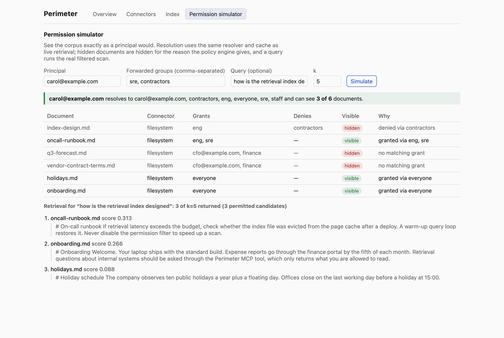

# Perimeter

Most retrieval-augmented systems fetch everything the index can find and then hope the
model behaves, or filter after the fact, which leaks through summarization and silently
turns "top 10" into "the 2 you were allowed to see". Perimeter applies the caller's
permission set **inside the index scan**, so unauthorized text is never scored, never
reranked, and never loaded, and `k` means what the caller thinks it means.

**The constraint:** one process, one container, no external vector database, deployable
air-gapped. The index is a flat, quantized, memory-mapped file; text lives in a document
store behind the same permission check; identity is forwarded by a trusted front door and
enforced, never issued. Exposed as an MCP tool server.

## Measured

Produced by `make bench` (`bench/results.md`, 50,000 chunks x 1024 dims). Every row is
also a CI gate; a regression fails the build.

| Metric | Measured | Budget |
|--------|---------:|-------:|
| p95 retrieval latency, all rows permitted | 5.70 ms | <= 30 ms |
| p95 retrieval latency, 10% of rows permitted | 3.09 ms | <= 30 ms |
| Peak RSS, sustained query loop | 248 MiB | <= 512 MiB |
| Index bytes per chunk | 1174 B | <= 1,280 B |
| recall@10 vs exact float32, all rows permitted | 0.976 | >= 0.95 |
| recall@10 vs exact float32, 10% permitted | 0.977 | >= 0.95 |
| Cohere API calls per query | 2 (1 embed, 1 rerank) | <= 2 |

Corpus: 50,000 chunks x 1024 dims (synthetic, clustered); k=10; 500 timed queries per
caller after 50 warm-up; Cohere ports stubbed at zero cost (calls counted); ACL resolver
calls per query 0.000 (cached); on disk 56.0 MiB. Environment: Python 3.12.13, NumPy
2.5.2, Darwin arm64 (Apple Silicon). Latency is Perimeter's own path (resolve, filtered
scan, int8 rescoring, store fetch, assembly); network round trips to the embedding and
rerank APIs are additive and not Perimeter's to optimise.

## The permission simulator

Preview the corpus as any principal. Hidden documents say why, and a query runs the real
filtered scan. Here `carol`, forwarded as `sre` and `contractors`, resolves through
`sre -> eng -> staff`; the best match for her query is hidden by the contractor deny, and
the result honestly reports 3 of k=5 with 3 permitted candidates.



## Security invariants

These are the product. Each has a named test marked `invariant` that fails the build.

| ID | Invariant | Enforced in |
|----|-----------|-------------|
| INV-1 | No chunk text is ever returned for a chunk whose policy does not admit the caller. | store read + orchestrator re-check (index filter is a third layer); proven over random policy graphs with Hypothesis, and with a deliberately leaky index |
| INV-2 | The candidate set entering the reranker is a subset of the caller's permitted set; filtering happens inside the scan. | `index/filtered_search.py`: only permitted rows are gathered before any distance is computed |
| INV-3 | Connector OAuth tokens never enter logs, traces, errors, or storage; request-scoped, dropped on exit. | `server/auth.py` request scope, `server/logging.py` redaction, `server/telemetry.py` attribute whitelist |
| INV-4 | An empty permitted set returns an empty result; never an unfiltered search. | orchestrator returns before embedding; index returns nothing for an empty allow-list |
| INV-5 | A stale ACL cache entry can only be more restrictive than reality; revocation is immediate, grants may lag by at most the TTL. | `adapters/caching_acl_resolver.py`: synchronous invalidation hook, never stale-on-error |

## Architecture

```
  MCP host / gateway (authenticates the user, forwards identity + connector tokens)
        |  X-Perimeter-Principal, X-Perimeter-Groups, X-Perimeter-Token-<connector>
        v
 +---------------------------- server ---------------------------------+
 |  auth.py (identity, request-scoped tokens)   telemetry.py (no PII)   |
 |  mcp.py  `retrieve` tool        http.py  /health, /admin/api, /admin/ |
 +----------------------------------|-----------------------------------+
                                    v
 +--------------------------- pipeline/retrieve.py ---------------------+
 |  1 resolve principals -> PermissionSet      (empty? return empty: INV-4)
 |  2 embed query                                                        |
 |  3 index.search(query, permitted, k*4)      (filter inside scan: INV-2)
 |  4 store.get_chunks(ids, permitted)         (text behind the check: INV-1)
 |  5 re-check policy, rerank, take k, cite    (INV-1 again)             |
 +----|-----------------|-----------------|--------------------|---------+
      v                 v                 v                    v
  AclResolver      EmbeddingModel     VectorIndex         DocumentStore     <- ports (core/ports.py)
  caching_acl_     cohere_/local_     index/flat.py       memory_store /    <- adapters
  resolver         embeddings         + filtered_search   postgres_store
                                      (mmap'd binary +
                                       int8 codes, CSR ACL
                                       rows, chunk IDs,
                                       NO TEXT)

  core/  (principal, acl, document, query, ports, errors)  imports nothing but stdlib;
         tests/test_architecture.py fails CI on a violation.
```

Design decisions are recorded in [`docs/adr/`](docs/adr/README.md). Start with
[`CLAUDE.md`](CLAUDE.md) for the map and [`docs/WALKTHROUGH.md`](docs/WALKTHROUGH.md)
for the guided tour and the hard questions.

## Run it

Air-gapped demo, no API key, in-memory store, deterministic local embedder:

```
make install
PERIMETER_GROUPS_FILE=examples/groups.json PERIMETER_ADMIN_DIST=admin/dist make run
```

Then, in another shell, add the demo corpus through the admin API and ask as a user:

```
curl -s -X POST localhost:8000/admin/api/connectors \
  -H 'content-type: application/json' \
  -d '{"name":"docs","kind":"filesystem","root":"'"$PWD"'/examples/corpus"}'
curl -s -X POST localhost:8000/admin/api/connectors/docs/ingest

curl -s -X POST localhost:8000/mcp \
  -H 'content-type: application/json' -H 'accept: application/json, text/event-stream' \
  -H 'X-Perimeter-Principal: carol@example.com' -H 'X-Perimeter-Groups: sre, contractors' \
  -d '{"jsonrpc":"2.0","id":1,"method":"tools/call","params":{"name":"retrieve","arguments":{"query":"how is the retrieval index designed","k":5}}}'
```

The admin console is at `http://localhost:8000/admin/` (build it first with
`make build-admin`). Point any MCP client that speaks StreamableHTTP at
`http://localhost:8000/mcp`; the front door must set the identity headers.

With Cohere (`embed-v4.0`, `rerank-v4.0-fast`) and Postgres:

```
COHERE_API_KEY=... PERIMETER_DATABASE_URL=postgresql://... make run
```

Configuration is by environment: `PERIMETER_DATA_DIR`, `PERIMETER_ACL_TTL_SECONDS`
(default 60; a security parameter, see ADR-004), `PERIMETER_ALLOWED_HOSTS`,
`PERIMETER_GROUPS_FILE`, `PERIMETER_ADMIN_DIST`, `PERIMETER_TRACE_CONSOLE`.

## Install

Python 3.12 with [uv](https://docs.astral.sh/uv/), Node 22 for the admin console.

```
make install          # uv sync --all-groups; npm ci in admin/
make check            # ruff, mypy --strict, pytest (incl. invariants)
make test-invariants  # INV-1..INV-5 only
make bench            # benchmark harness -> bench/results.md
make bench-gate       # the CI budget gates at 50k chunks
make build-admin      # vite build -> admin/dist
make container        # docker build -t perimeter:local .
```

The container is a multi-stage build (node for the console, uv for Python, slim non-root
runtime). `docker` was not available on the machine this repository was built on, so the
image build is exercised by CI rather than by hand here.
